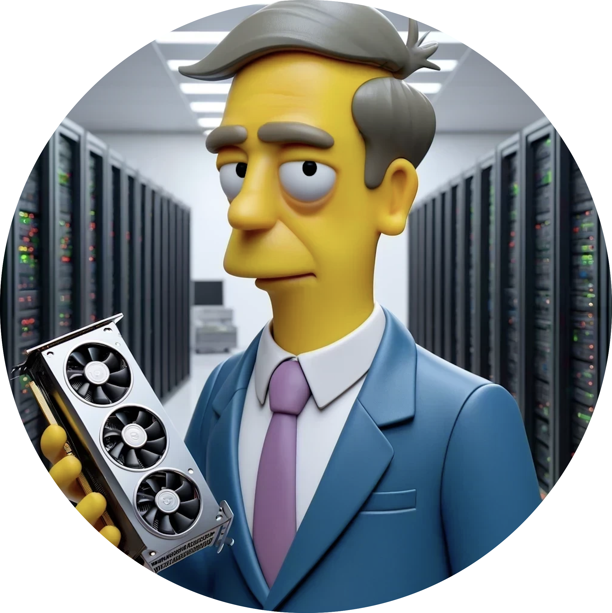

# seemore

    

 

Developed using Databricks with ❤️

#### Vision Language Model developed from scratch with Pytorch

The input.txt with tinyshakespear and the base64 encoded string representations + corresponding descriptions are in the inputs.csv file in the images directory.

In this simple implementation of a vision language model (VLM), there are 3 main components. 

1. Image Encoder to extract visual features from images. In this case I use a from scratch implementation of the original vision transformer used in CLIP. This is actually a popular choice in many modern VLMs. The one notable exception is Fuyu series of models from Adept, that passes the patchified images directly to the projection layer.
   
2. Vision-Language Projector - Image embeddings are not of the same shape as text embeddings used by the decoder. So we need to ‘project’ i.e. change dimensionality of image features extracted by the image encoder to match what’s observed in the text embedding space. So image features become ‘visual tokens’ for the decoder. This could be a single layer or an MLP. I’ve used an MLP because it’s worth showing.

3. A decoder only language model. This is the component that ultimately generates text. In my implementation I’ve deviated from what you see in LLaVA etc. a bit by incorporating the projection module to my decoder. Typically this is not observed, and you leave the architecture of the decoder (which is usually an already pretrained model) untouched.

Everything is written from the ground up using pytorch. That includes the attention mechanism (both for the vision encoder and language decoder), patch creation for the vision transformer and everything else. Hope this is useful for anyone going through the repo and/ or the associated blog.

seemore.py is the entirety of the implementation in a single file of pytorch.

seemore_from_Scratch.ipynb walks through the intuition for the entire model architecture and how everything comes together. I recommend starting here.

seemore_Concise.ipynb is the consolidated hackable implementation that I encourage you to hack, understand, improve and make your own
   
**The code was entirely developed on Databricks using a single A100 for compute. If you're running this on Databricks, you can scale this on an arbitrarily large GPU cluster with no issues, on the cloud provider of your choice.**

**I chose to use MLFlow (which comes pre-installed in Databricks. It's fully open source and you can pip install easily elsewhere) as I find it helpful to track and log all the metrics necessary. This is entirely optional but encouraged.**

**Please note that the implementation emphasizes readability and hackability vs. performance, so there are many ways in which you could improve this. Please try and let me know!**

Hope you find this useful. Happy hacking!!
